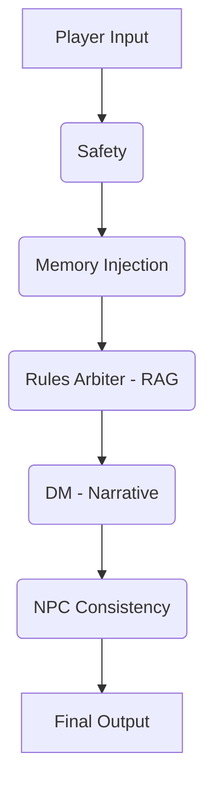
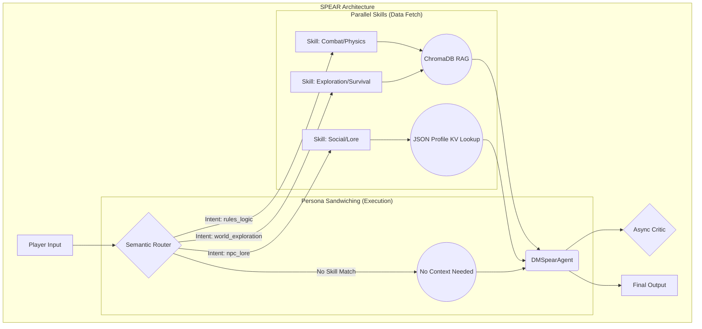

# The SPEAR Architecture: A Technical Breakdown

This document details the architectural evolution of the RAGnarok TTRPG engine, transitioning from a monolithic, linear **Baseline** system to a modular, parallel **SPEAR** architecture.

## The Baseline (Monolithic/Linear)

The original Baseline architecture operates as a simple, sequential chain of agents. Every player input is processed through the exact same series of steps, regardless of context or intent.

### Structure

### Workflow

The data flow is rigid. A player's input string is passed from one agent to the next, with each agent adding its analysis or transformation to the context before passing it downstream.

1.  **Player Input**: The initial turn action.
2.  **Safety**: A basic filter for harmful content.
3.  **Memory Injection**: The full world state and recent events are injected into the prompt.
4.  **Rules Arbiter (RAG)**: A vector search is performed against the game's rulebook.
5.  **DM (Narrative)**: The LLM generates a response based on the combined context.
6.  **NPC Consistency**: A final LLM call attempts to refine dialogue to match character profiles.

### Architectural Flaws

This design suffers from several critical inefficiencies:

-   **Agent Bloat**: Every agent fires on every single turn. A simple social interaction ("I ask Thrain for a drink") incorrectly triggers a time-consuming RAG search of the combat rulebook, wasting tokens and adding latency.
-   **Latency Stacking**: Because each step is a blocking API call that must complete before the next can begin, the total turn time is the sum of all individual agent latencies.
-   **The "Alzheimer's Effect"**: By injecting all available context (rules, history, NPCs) into a single monolithic prompt, the model's attention is diluted. This often leads to a degradation of persona and a failure to adhere to specific instructions as the token count climbs.

---

## The SPEAR Architecture (Modular/Parallel)

**SPEAR** (**S**upervised, **P**arallel, **E**valuated **A**gentic **R**outer) is a complete redesign focused on efficiency, modularity, and intelligent context management. It operates as a Progressive Disclosure State Machine, ensuring that only necessary resources are activated.

### Structure

### Workflow

The SPEAR workflow is dynamic and intent-driven.

1.  **Semantic Router (Supervisor)**: The player's input is first sent to a lightweight, high-speed LLM router. This router's *only job* is to determine the user's intent by analyzing the query against a small set of "Skill" metadata. This decision happens in ~100ms.
2.  **Parallel Skills**: Based on the router's decision, the system fires off concurrent, non-blocking calls to fetch *only* the necessary data. If the intent is social, it queries the NPC JSON files. If it's combat-related, it triggers the ChromaDB vector search. These run in parallel, and the slowest fetch determines the ceiling.
3.  **Persona Sandwiching**: The `DMSpearAgent` is decoupled from the underlying mechanics. It receives a "payload" containing only the relevant instructions and retrieved context for the turn. This isolates the creative narrative task from the technical data-retrieval, preserving the LLM's persona and focus.
4.  **Async Reflection**: After the response is sent to the player, a non-blocking background thread sends the turn data to a **Critic Agent**. This agent evaluates the turn for rule accuracy and narrative coherence *without making the player wait*. Its findings are logged for analysis, providing a mechanism for evaluation without adding to gameplay latency.

---

## Head-to-Head Comparison

The fundamental difference lies in how the two architectures manage context and latency.

| Feature | Baseline: Linear Stalling | SPEAR: Parallel Precision |
| :--- | :--- | :--- |
| **Control Flow** | **Sequential Chain**: Every agent fires, every time. | **State-Driven**: A router activates only necessary agents. |
| **Prompt Strategy**| **Full-Prompt Injection**: All context is loaded into one bloated prompt, diluting focus. | **57.14% Skill Sparsity**: Context is injected on-demand based on intent, keeping prompts lean. |
| **Correction Loop**| **None**: Hallucinations and errors are passed directly to the user. | **Async Reflection**: A non-blocking `Critic` evaluates turns post-facto without impacting latency. |
| **Memory Model** | **Monolithic Memory**: All memory is treated equally, contributing to prompt bloat. | **Shallow + Deep Memory**: "Shallow" memory (location, active NPCs) is used for fast routing, while "Deep" memory (intent-based RAG) is only accessed when a relevant skill is triggered. |

---

## Technical Conclusion

While the Baseline architecture is simple to implement, its monolithic nature makes it fundamentally unscalable for real-time applications. The "Agent Bloat" and "Latency Stacking" create a poor user experience and incur unnecessarily high token costs, as every agent must be consulted on every turn.

**SPEAR is academically superior for real-time applications** because it treats latency and token cost as first-class constraints. By:
1.  Using a fast, intelligent **Semantic Router** to prune unnecessary work.
2.  Executing data retrieval in **parallel**.
3.  Isolating the narrative agent from mechanical details via **Persona Sandwiching**.
4.  Moving evaluation to a non-blocking **Async Reflection** loop.

SPEAR consistently delivers faster, cheaper, and more contextually relevant responses, proving that an intelligent, sparse-activation architecture is more effective than a brute-force sequential chain.
