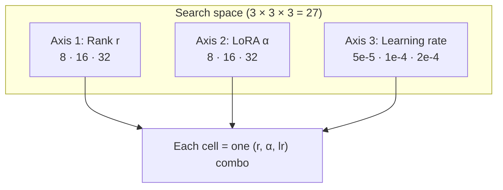
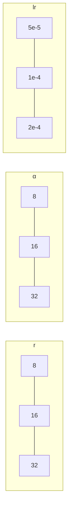
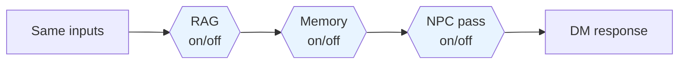

# Hyperparameters & ablation — slide layouts (HP-1…3, AB-1…5)

Figures are generated with:

```bash
python scripts/generate_presentation_plots.py
```

Output folder: **`data/plots/presentation/`** — see **`README_SLIDES.md`** there for the exact filename list.

---

## SECTION: Hyperparameters

### Slide HP-1 — What we search

**Title:** LoRA hyperparameter search  

**Bullets (as in your outline):** Rank (r), LoRA α, learning rate, full grid 3×3×3 = **27** combinations.

**Visual A — Mermaid (conceptual 3-axis grid)**  
Use at [mermaid.live](https://mermaid.live); export **wide** PNG for slides.

> **Note:** Your saved runs may be a **subset** of 27 (e.g. only some ranks). The diagram still explains the *search space*; the numeric plots reflect *what you actually ran* (`data/hparam_results.json`).



**Optional — “cube” feel (three parallel tracks):**



**Visual B — Project figure (actual results)**  
- **`01_hparam_grid_search_space.png`** — all combos in the **loss** grid (best cell highlighted).  
- **`02_hparam_grid_perplexity.png`** — same in **perplexity** (audience-friendly).

---

### Slide HP-2 — How we run it efficiently

**Title:** Fast screen before full training  

**Figure:** **`03_hparam_ranked_by_loss.png`** (or **`04_hparam_ranked_by_perplexity.png`**) — bars sorted; best highlighted.

---

### Slide HP-3 — Best config → full run

**Title:** Best config → full fine-tune  

**Visual:** Reuse **ranked bar** from HP-2 + one **callout** text box with your best `(r, α, lr)` from `hparam_results.json` (example: **16 / 32 / 2e-4** if that row wins). Arrow: **“→ `finetune_fireball.py` · 3 epochs · export to Ollama”**.

---

## SECTION: Ablation study

### Slide AB-1 — Question

**Title:** What does each component add?  

**Visual — toggles on the pipeline (Mermaid):**



---

### Slide AB-2 — Configurations

**Title:** Seven configurations  

Use a **table on-slide** (font ≥ 20 pt); see appendix table in `presentation_slide_visual_aids.md`. No plot required.

---

### Slide AB-3 — Metrics

**Title:** How we score outputs  

**Visual:** **Icon row** + one line per metric (ROUGE, BERTScore, BLEU, chrF, rule coverage, latency, optional LLM-judge). Avoid a dense metric table.

---

### Slide AB-4 — Results (honest takeaway)

**Title:** Results: trade-offs, not one magic winner  

**Primary figures (from `generate_presentation_plots.py`):**

| Story | File |
|--------|------|
| Δ vs baseline (what breaks when you remove X) | `pres_ablation_deltas_vs_baseline.png` |
| Grouped scores across configs | `pres_ablation_scores_grouped.png` |
| Quality vs latency | `pres_ablation_quality_vs_latency.png` |
| Full picture (appendix) | `pres_ablation_metric_heatmap.png` |

Pick **one** primary chart for the slide; move the rest to backup / appendix.

---

### Slide AB-5 — One-line closing (optional)

**Title:** Takeaway  

**Figure:** **`pres_ablation_quality_vs_latency.png`** or **`pres_ablation_metric_heatmap.png`** (your “best single project figure”).

---

## Cross-links

- Combined script details: `scripts/evaluate_ablation_combine.py`  
- Hparam search: `scripts/hparam_search.py`, results: `data/hparam_results.json`
