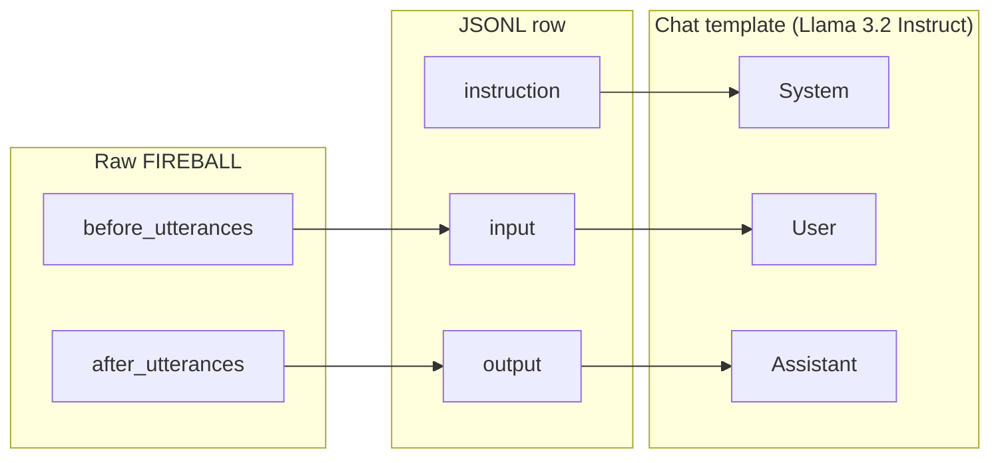
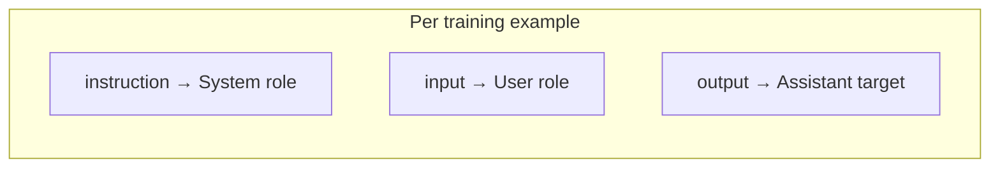

# Presentation visual aids — RAGnarok (3 slides)

Use Mermaid diagrams at https://mermaid.live → Export PNG/SVG → drop into slides.

**Hyperparameter + ablation slide-by-slide layouts (HP-1…3, AB-1…5), Mermaid grids/toggles, and figure filenames:** see **`docs/presentation_hp_ab_slides.md`**.  
**One-command figures:** `python scripts/generate_presentation_plots.py` → `data/plots/presentation/`.

---

## Slide 1 — FIREBALL dataset & training format

### Title options (pick one)
- **Fine-tuning data: FIREBALL → chat format**
- **Teaching the DM with real session transcripts**
- **Dataset pipeline: FIREBALL to Llama chat**

### One-line subtitle
*~25k player→DM pairs from recorded D&D 5e games → JSONL → instruction-tuned LoRA*

### Visual A — Data flow (left → right)

### Visual B — Same idea as stacked mapping (for a second slide or appendix)

### Minimal bullets (only if space remains)
- **FIREBALL:** real sessions; each row = what players said → what the DM said next.
- **prepare_fireball.py:** 90/10 split → `fireball_train.jsonl` / `fireball_eval.jsonl`.
- **Training target:** predict **Assistant** (DM) given **System + User**.

---

## Slide 2 — Hyperparameters & fine-tuning

### Title options
- **Hyperparameter search → full LoRA fine-tune**
- **From grid search to deployment**

### Layout suggestion (two columns)
| **Left: Grid search** | **Right: Full training** |
|------------------------|---------------------------|
| 27 configs (r × α × lr) on **subset**, 1 epoch | 3 epochs on **full** train split |
| **Pick:** min **eval loss** (= min **perplexity**) | Export **GGUF** → **Ollama** |
| `data/hparam_results.json` | `finetune_fireball.py` |

### Why both Loss and Perplexity (one sentence)
**Cross-entropy loss** is what we train on; **perplexity = exp(loss)** — same ranking, easier to interpret (“effective vocabulary size” intuition).

### One figure strategy
- **Primary:** `hparam_grid_all_perplexity.png` (audience-friendly)
- **Backup small inset:** `hparam_grid_all.png` (loss) *or* say “equivalent ranking under loss”

---

## Slide 3 — Ablation study

### Title
**What each pipeline component adds**

### Short bullets (max 5)
1. **Same inputs** for every run; toggle **RAG / Memory / NPC**; compare **Groq vs local FT**.
2. **7 configurations** — isolate contribution of rules + memory + NPC + model.
3. **Metrics:** overlap (ROUGE, BERTScore, …), **rule coverage**, **latency**, optional **LLM judge**.
4. **Takeaway:** **No single winner** — e.g. RAG boosts rule-language; **Groq** faster; **local FT** trade-offs vary by metric.

### Visualizations to use (small + readable)

| Priority | File | Use for |
|----------|------|---------|
| 1 | `data/plots/ablation_combined_deltas.png` or `ablation_impact.png` | “What drops when we remove X” |
| 2 | `data/plots/quality_vs_latency.png` | Trade-off story |
| 3 | `data/plots/hparam_heatmaps.png` | — skip here; use hparam slide only |
| 4 | `data/plots/scores_grouped.png` or combined heatmap from `evaluate_ablation_combine.py` | Side-by-side quality |

**Tip:** One **big** chart + **3 words** takeaway under it beats many small charts.

---

## Appendix: 7 ablation configs (tiny table for slide footer)

| Config | RAG | Mem | NPC | Backend |
|--------|-----|-----|-----|---------|
| Full Pipeline (Groq) | ✓ | ✓ | ✓ | Groq |
| No RAG | ✗ | ✓ | ✓ | Groq |
| No Memory | ✓ | ✗ | ✓ | Groq |
| No NPC Pass | ✓ | ✓ | ✗ | Groq |
| Bare DM | ✗ | ✗ | ✗ | Groq |
| Local FT (RAG On) | ✓ | ✓ | ✓ | Ollama |
| Local FT (No RAG) | ✗ | ✓ | ✓ | Ollama |
